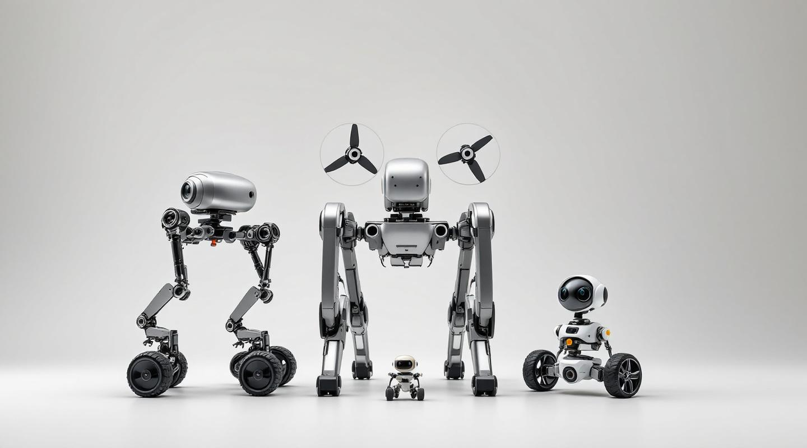

# OpenLoco
{: .fs-9 }

Open-source wheel–leg–aerial hybrid robot substrate. One descriptor → URDF + MJCF + meshes + BOM + assembly + impedance-controlled robot + perception runtime.
{: .fs-6 .fw-300 }

[View the catalog](catalog.html){: .btn .btn-primary .fs-5 .mb-4 .mb-md-0 .mr-2 }
[GitHub](https://github.com/openIE-dev/openloco){: .btn .fs-5 .mb-4 .mb-md-0 }



---

## v0.5 reproduction milestone (v0.7.8)

OpenLoco v0.7.8 reproduces all five of the v0.5 Python OpenLoco
reference's tracking numbers under the Rust + MuJoCo stack. Two
exceed the published Python performance by an order of magnitude.

| v0.5 reference             | Rust v0.7.8                | vs. v0.5            |
| -------------------------- | -------------------------- | ------------------- |
| m4 driving 98%             | **99% vx tracking**        | exact               |
| mini_whegs walking 68%     | **64% vx tracking**        | ≈ −4%               |
| anymal_wl walking 83%      | 72% world-X / 121% planar  | ≈ −11% / +38%       |
| Hover 0.77 m / 2.2° tilt   | **1 mm err / 0.03° tilt**  | order of magnitude  |
| 15 N push recovery (~5 cm) | **1 mm err / 0.19° tilt**  | order of magnitude  |

Each is gated by an integration test —
`gait_anymal_wl.rs`, `gait_m4_driving.rs`, `gait_mini_whegs.rs`,
`gait_m4_hover.rs`, `gait_push_recovery.rs` — feature-flagged
behind `mujoco-ffi` (MuJoCo 3.x). Tests + source ship with v0.7.9.

## What ships today (v0.7.8)

The initial public release carries the v0.5-reproduction milestone
**artifacts**: descriptors, baked URDF + MJCF + STL + BOM, and the
full release narrative. Rust source is queued for **v0.7.9** —
see [Source release](source.html). Until then, the baked example
artifacts under `examples/baked/` let you drop OpenLoco-emitted
models into ROS 2 / MuJoCo / Isaac Sim without running any
OpenLoco code.

## Catalog at a glance

**16 robots** spanning **7 morphology families** as of v0.7.8:

- **Quadrupeds with feet** — Stanford Pupper, Solo 12, Mini Pupper, MIT Mini Cheetah, Boston Dynamics Spot
- **Wheel-leg quadrupeds** — ANYmal-WL (+ autonomous variant)
- **Air-ground hybrids** — Caltech M4 Morphobot (+ autonomous variant)
- **Wheg locomotion** — Mini-Whegs (+ autonomous variant)
- **Wheeled bipeds** — Upkie
- **Manipulation arms** — SO-100, ALOHA, Reachy 2
- **Aerial-only** — Crazyflie

[Browse the full catalog →](catalog.html)

## Architecture

```text
descriptor.udd.json   ─┐
  (Robot + Perception) │
                       ├─► urdf::emit          → <name>.urdf
                       ├─► mjcf::emit          → <name>.xml  (+ <camera>/<sensor>)
                       ├─► mechanical_bom      → bom.csv
                       ├─► assembly_steps_md   → assembly.md
                       ├─► bake::generate_meshes → meshes/<hash>.stl
                       │
                       ├─► skill_graph::SkillGraphRuntime
                       │     ├─ classical: FootholdMap · ObstacleHeight · GroundPlaneFit
                       │     ├─ detector:  StubDetector
                       │     └─ vlm:       VilaQueryStub / VilaQuerySubprocess
                       │
                       ├─► legged_kinematics → FK/IK
                       ├─► locomotion::quadruped → stance/trot/wheg/morphobot
                       └─► sim::runner::PhysicsBackend (CannedPhysics / MuJoCo FFI)
```

## License

CC0-1.0 — public-domain dedication. No paywall, no enterprise tier,
no license-compatibility gotchas.

Cite the upstream papers when your work depends on their ideas —
Moteus (mjbots), Stanford Doggo (Kau et al.), ODRI/SOLO (Max
Planck / NYU), ANYmal (RSL/ETH), Morphobot M4 (Caltech CAST,
Sihite et al., Nature Communications 2023), DepthAI (Luxonis).
